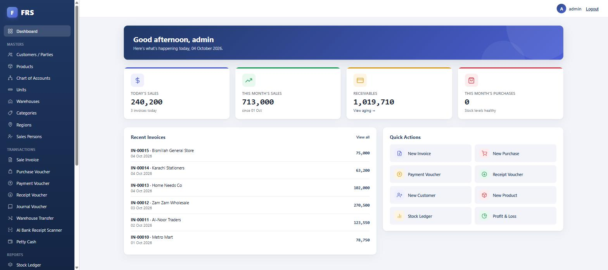
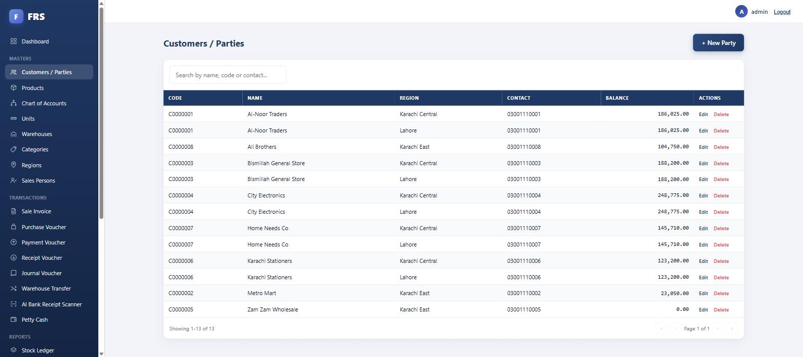
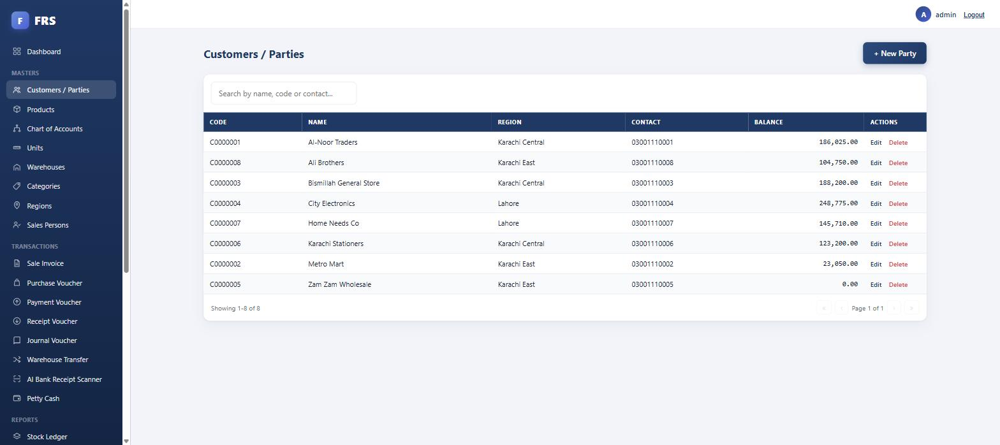

# 📊 ERP — Accounting & Inventory

A web-based ERP for distribution and trading businesses: accounting, inventory, sales and purchasing in one secure system, built by migrating a legacy desktop application to ASP.NET Core.

> **Showcase repository.** This page documents the project's features and architecture. The source code is proprietary and delivered to the client, so it is not published here.

## ✨ Features

- **Accounting** — chart of accounts, vouchers, ledgers, trial balance and financial reports
- **Inventory** — items, stock movement, multiple units and stock valuation
- **Sales & purchasing** — invoices, returns, supplier and customer management
- **Distribution workflows** — routes, salesmen and area-wise tracking
- **Role & permission model** — per-user, per-screen access control
- **Real-time updates** — live notifications through SignalR
- **Backup / restore** — built-in database backup and recovery

## 🧱 Tech Stack

| Layer | Technology |
|-------|-----------|
| Backend | C#, ASP.NET Core MVC (.NET 9) |
| Data access | Dapper with SQL Server stored procedures |
| Database | Microsoft SQL Server |
| Frontend | JavaScript, jQuery, Bootstrap |
| Security | Cookie authentication, role / permission based authorization |

## 🤝 Need something similar?

I build custom ERP, hotel, pharmacy and ordering systems, and modernize legacy WinForms / VB.NET apps to ASP.NET Core. See my [profile](https://github.com/SalmanDosani-Dev) for more.

## 📸 Screenshots

| | |
|---|---|
|  |  |
|  | |
